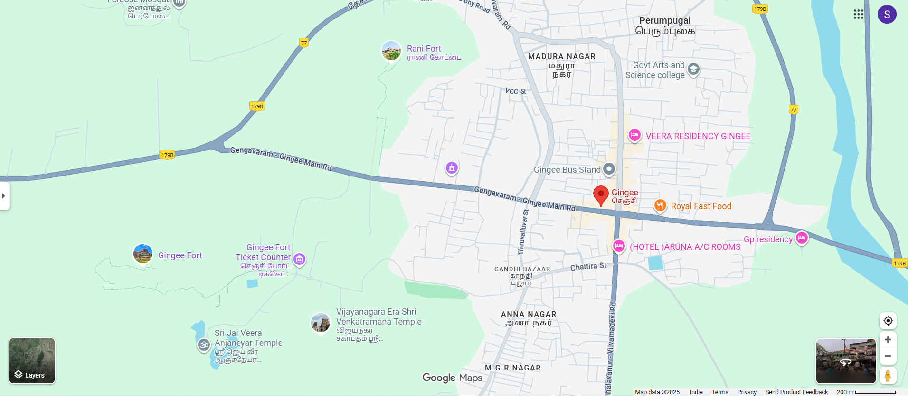

# Ex04 Places Around Me
## Date: 26.09.25

## AIM
To develop a website to display details about the places around my house.

## DESIGN STEPS

### STEP 1
Create a Django admin interface.

### STEP 2
Download your city map from Google.

### STEP 3
Using ```<map>``` tag name the map.

### STEP 4
Create clickable regions in the image using ```<area>``` tag.

### STEP 5
Write HTML programs for all the regions identified.

### STEP 6
Execute the programs and publish them.

## CODE
~~~
busstand.html
<!DOCTYPE html>
<html>
<head>
    <title>Bus Stand</title>
</head>
<body bgcolor="lightcyan">
    <h1 align="center">
        <font color="darkblue"><b>Central Bus Stand</b></font>
    </h1>
    <h3 align="center">
        <font color="brown"><b>A Hub of Travel and Connectivity</b></font>
    </h3>
    <hr size="3" color="darkblue">
    <p align="justify">
        <font face="Georgia" size="5">
            The Central Bus Stand is a busy transit point connecting 
            towns and cities with regular services. With spacious platforms, 
            ticket counters, waiting halls, and modern facilities, 
            it serves as a lifeline for daily commuters and travelers. 
            The bustling atmosphere reflects the movement and energy of people 
            embarking on journeys near and far.
        </font>
    </p>
</body>
</html>

gandhibaazar.html
<!DOCTYPE html>
<html>
<head>
    <title>Gandhi Bazaar</title>
</head>
<body bgcolor="peachpuff">
    <h1 align="center">
        <font color="darkred"><b>Gandhi Bazaar</b></font>
    </h1>
    <h3 align="center">
        <font color="green"><b>A Traditional Shopping Street</b></font>
    </h3>
    <hr size="3" color="darkred">
    <p align="justify">
        <font face="Georgia" size="5">
            Gandhi Bazaar is one of the oldest and most vibrant marketplaces, 
            known for its colorful flower stalls, fresh vegetables, traditional 
            items, and lively atmosphere. A walk through the street captures 
            the essence of local culture, where heritage and modern life blend 
            seamlessly. It remains a favorite destination for shoppers and 
            visitors alike.
        </font>
    </p>
</body>
</html>

gingee.html
<!DOCTYPE html>
<html>
<head>
    <title>Gingee</title>
</head>
<body bgcolor="lightyellow">
    <h1 align="center">
        <font color="maroon"><b>Gingee Fort</b></font>
    </h1>
    <h3 align="center">
        <font color="green"><b>Nature's Peaceful Retreat</b></font>
    </h3>
    <hr size="3" color="brown">
    <p align="justify">
        <font face="Georgia" size="5">
            Gingee, often called the "Troy of the East," is famous for its mighty fort 
            built on rocky hills. Surrounded by natural beauty, the fort offers stunning 
            views, historic structures, and a serene atmosphere for visitors.
        </font>
    </p>
</body>
</html>

gingeefort.html
<!DOCTYPE html>
<html>
<head>
    <title>Gingee Fort</title>
</head>
<body bgcolor="mistyrose">
    <h1 align="center">
        <font color="darkred"><b>Gingee Fort</b></font>
    </h1>
    <h3 align="center">
        <font color="blue"><b>The Pride of Tamil Nadu</b></font>
    </h3>
    <hr size="3" color="darkred">
    <p align="justify">
        <font face="Georgia" size="5">
            Gingee Fort, built during the 9th century by the Cholas and later 
            strengthened by the Vijayanagara rulers, is one of the most 
            remarkable forts in South India. Spread across three hillocks, 
            the fort is known for its massive walls, hidden passages, and 
            strategic architecture. It stands as a symbol of valor, history, 
            and architectural brilliance.
        </font>
    </p>
</body>
</html>

map.html
<html>
<head>
<title>My city</title>
</head>
<body>
<h1 align="center">
<front color="red"><b>Gingee</b></font>
</h1>
<h3 align="center">
<font color=""blue"><b>Samrin (25012955</b></font>
</h3>
<center>


<map name="image-map">
    <area target="_blank" alt="gingee" title="gingee" href="gingee.html" coords="1063,493,1409,389" shape="rect">
    <area target="_blank" alt="gingee" title="gingee" href="gingeefort.html" coords="252,489,463,577" shape="rect">
    <area target="_blank" alt="busstand" title="busstand" href="busstand.html" coords="1136,319,1340,390" shape="rect">
    <area target="_blank" alt="ranifort" title="ranifort" href="ranifort.html" coords="759,55,1000,171" shape="rect">
    <area target="_blank" alt="gandhibaazar" title="gandhibaazar" href="gandhibaazar.html" coords="1004,534,1189,629" shape="rect">
</map>
</center>
</body>
</html>

ranifort.html
<!DOCTYPE html>
<html>
<head>
    <title>Rani Fort</title>
</head>
<body bgcolor="lavender">
    <h1 align="center">
        <font color="darkgreen"><b>Rani Fort</b></font>
    </h1>
    <h3 align="center">
        <font color="crimson"><b>A Symbol of Courage and Heritage</b></font>
    </h3>
    <hr size="3" color="darkgreen">
    <p align="justify">
        <font face="Georgia" size="5">
            Rani Fort stands as a proud reminder of India's glorious past. 
            Known for its strong defensive walls, ancient gateways, and 
            beautiful surroundings, the fort reflects the valor of the 
            queens who once defended it. Today, it remains a popular 
            destination for history lovers and travelers seeking to explore 
            stories of bravery and tradition.
        </font>
    </p>
</body>
</html>
~~~


## OUTPUT


## RESULT
The program for implementing image maps using HTML is executed successfully.
